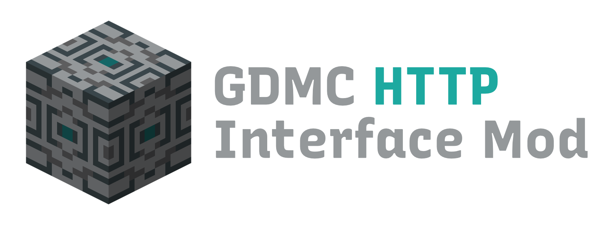

# GDMC HTTP Interface Mod

Mod for Minecraft (Java Edition) that implements an HTTP interface for reading and writing blocks (and more).

With this interface you can use other applications and scripts running on the same machine to read and modify a Minecraft world.

This is designed as a tool for the [Generative Design in Minecraft Competition (GDMC)](https://gendesignmc.wikidot.com), an annual competition for generative AI systems in Minecraft, where the challenge is to write an algorithm that creates a settlement while adapting to pre-existing terrain. Feel free to join our [community Discord server](https://discord.gg/YwpPCRQWND)!

| Minecraft version | GDMC-HTTP version                                                                           | Docs                                                                                          | GDMC competition year                                                                                                                                                    |
|-------------------|---------------------------------------------------------------------------------------------|-----------------------------------------------------------------------------------------------|--------------------------------------------------------------------------------------------------------------------------------------------------------------------------|
| 1.20.2            | 📦 [GDMC-HTTP 1.5.0](https://github.com/Niels-NTG/gdmc_http_interface/releases/tag/v1.5.0)  | 📒 [API Docs](https://github.com/Niels-NTG/gdmc_http_interface/tree/v1.5.0/docs/Endpoints.md) | [2024](https://gendesignmc.wikidot.com/wiki:2024-settlement-generation-competition), 2025                                                                                |
| 1.19.2            | 📦 [GDMC-HTTP 1.5.0](https://github.com/Niels-NTG/gdmc_http_interface/releases/tag/v1.5.0)  | 📒 [API Docs](https://github.com/Niels-NTG/gdmc_http_interface/tree/v1.5.0/docs/Endpoints.md) | [2023](https://gendesignmc.wikidot.com/wiki:2023-settlement-generation-competition)                                                                                      |
| 1.16.5            | 📦 [GDMC-HTTP 0.4.2](https://github.com/nikigawlik/gdmc_http_interface/releases/tag/v0.4.2) | 📒 [API Docs](https://github.com/nikigawlik/gdmc_http_interface/wiki)                         | [2021](https://gendesignmc.wikidot.com/wiki:2021-settlement-generation-competition), [2022](https://gendesignmc.wikidot.com/wiki:2022-settlement-generation-competition) |

Jump to: [Installation](#Installation) | [Usage](#Usage) | [Acknowledgements](#Acknowledgements)

## Installation

## Automated installation (recommended)

Custom Minecraft launchers such as [Modrinth App](https://modrinth.com/app) or [Prism Launcher](https://prismlauncher.org/) make it easy to create separate instances of the game and can automatically install the mods you want for you, including any dependencies these mods may require such as modding frameworks.

The following instructions are for the Modrinth App, but other custom launchers will follow similar steps.

1. Download and install the free and open source [Modrinth App](https://modrinth.com/app). When starting it for the first time, you will be prompted to authenticate with your Microsoft/Minecraft account.
2. Click the 🔎 "Browse" button in the sidebar and search in the mods category for "[GDMC HTTP Interface](https://modrinth.com/mod/gdmc-http-interface/)".
3. Clicking "Install" will install the latest version, including the necessary dependencies. Alternatively you can pick a specific version from the "Versions" section on the mod's page. In the installation modal you can choose to add the mod to an existing compatible instance or create a new one.
4. After the app has finished preparing the instance, you can click "Play" to launch your modded version of Minecraft.

## Manual installation

Since GDMC-HTTP 1.5.0 this mod supports both the Fabric and Forge mod loaders within the same `.jar` file.

The following installation instructions are for installing this mod in the Minecraft client, but GDMC-HTTP also works on the Minecraft server with either the Fabric or Forge mod loader installed.

### Fabric

Installation instructions for when using the Fabric mod loader.

1. You need to own a copy of [Minecraft](https://www.minecraft.net/) Java Edition and have it installed on your machine.
2. Get the [Fabric Mod Installer](https://fabricmc.net/use/installer/). Just click on "Download Installer" to download.
3. Open the downloaded file to install this version of Fabric.
   - Here are some troubleshooting resources If you have trouble opening this jar file:
      - [macOS](https://discussions.apple.com/thread/252960079)
      - [Ubuntu and Ubuntu-based Linux distros](https://itsfoss.com/run-jar-file-ubuntu-linux/)
4. Download this mod's jar file from [here](https://github.com/Persson-dev/gdmc_http_fabric/releases/latest) and move it in the mod folder:
   - On Windows: `%APPDATA%/.minecraft/mods`.
   - On macOS: `~/Library/Application\ Support/Minecraft/mods`.
   - On Linux desktop: `~/.minecraft/mods`
5. Get the [Fabric Api Mod](https://modrinth.com/mod/fabric-api). Download the same version as above and move it in the mod folder.
6. Open the Minecraft launcher, go to the "Installations" tab and click "Play" on the Fabric installation in the list.

### Forge

Installation instructions for when using the Forge mod loader.

1. You need to own a copy of [Minecraft](https://www.minecraft.net/) Java Edition and have it installed on your machine.
2. Get the [Forge Mod Installer](https://files.minecraftforge.net/net/minecraftforge/forge/) and navigate to your version of Minecraft that is supported by this mod (1.20.2, 1.19.2 or 1.16.5) and click "Installer" under the "Download Recommended" section to download.
3. Open the downloaded file to install this version of Forge.
    - Here are some troubleshooting resources If you have trouble opening this jar file:
        - [macOS](https://discussions.apple.com/thread/252960079)
        - [Ubuntu and Ubuntu-based Linux distros](https://itsfoss.com/run-jar-file-ubuntu-linux/)
4. Download this mod's jar file from [here](https://github.com/Niels-NTG/gdmc_http_interface/releases/latest) and move it in the mod folder:
    - On Windows: `%APPDATA%/.minecraft/mods`.
    - On macOS: `~/Library/Application\ Support/Minecraft/mods`.
    - On Linux desktop: `~/.minecraft/mods`
5. Open the Minecraft launcher, go to the "Installations" tab and click "Play" on the Forge installation in the list.

## Usage

When you open a Minecraft world, you will see a chat message that the mod has opened an HTTP connection at the address `localhost:9000`. This means that you can now send HTTP requests from an external program to Minecraft while the world is open.

For testing and experimentation we recommend an API testing tool such as [Kreya](https://kreya.app), [Yaak](https://yaak.app) or a command line tool such as `cURL` or `wget`.

When you want to build your own settlement generator or some other application, we recommend using the [GDPC](https://github.com/avdstaaij/gdpc) Python library, which is purpose-built by the GDMC community to work with this mod. But any programming or scripting language that supports communication over HTTP (which includes most of them, be it either built-in or via an easy-to-use library) will work.

### HTTP Endpoints

When the HTTP interface is active, you have access to the following HTTP endpoints:

| HTTP method | URL          | Description                                        | Docs                                                                                                                                    |
|-------------|--------------|----------------------------------------------------|-----------------------------------------------------------------------------------------------------------------------------------------|
| `POST`      | `/commands`  | 📜 Send Minecraft console commands                 | 📒 [API Docs](https://github.com/Niels-NTG/gdmc_http_interface/blob/v1.5.0/docs/Endpoints.md#-send-commands-POST-commands)              |
| `GET`       | `/blocks`    | 🧱 Get information on blocks in a given area       | 📒 [API Docs](https://github.com/Niels-NTG/gdmc_http_interface/blob/v1.5.0/docs/Endpoints.md#-read-blocks-GET-blocks)                   |
| `PUT`       | `/blocks`    | 🧱 Place blocks                                    | 📒 [API Docs](https://github.com/Niels-NTG/gdmc_http_interface/blob/v1.5.0/docs/Endpoints.md#-place-blocks-PUT-blocks)                  |
| `GET`       | `/biomes`    | 🏜️ Get information on biomes in a given area      | 📒 [API Docs](https://github.com/Niels-NTG/gdmc_http_interface/blob/v1.5.0/docs/Endpoints.md#-read-biomes-GET-biomes)                   |
| `GET`       | `/chunks`    | ⛏ Get raw chunk data in a given area               | 📒 [API Docs](https://github.com/Niels-NTG/gdmc_http_interface/blob/v1.5.0/docs/Endpoints.md#-read-chunk-data-GET-chunks)               |
| `GET`       | `/structure` | 🏗️ Create an NBT structure file from a given area | 📒 [API Docs](https://github.com/Niels-NTG/gdmc_http_interface/blob/v1.5.0/docs/Endpoints.md#-create-NBT-structure-file-GET-structure)  |
| `POST`      | `/structure` | 🏗️ Place an NBT structure file into the world     | 📒 [API Docs](https://github.com/Niels-NTG/gdmc_http_interface/blob/v1.5.0/docs/Endpoints.md#-place-NBT-structure-file-POST-structure)  |
| `GET`       | `/entities`  | 🐷 Get information on entities in a given area     | 📒 [API Docs](https://github.com/Niels-NTG/gdmc_http_interface/blob/v1.5.0/docs/Endpoints.md#-read-entities-GET-entities)               |
| `PUT`       | `/entities`  | 🐷 Summon entities into the world                  | 📒 [API Docs](https://github.com/Niels-NTG/gdmc_http_interface/blob/v1.5.0/docs/Endpoints.md#-create-entities-PUT-entities)             |
| `PATCH`     | `/entities`  | 🐷 Edit entities that already exist in the world   | 📒 [API Docs](https://github.com/Niels-NTG/gdmc_http_interface/blob/v1.5.0/docs/Endpoints.md#-edit-entities-PATCH-entities)             |
| `DELETE`    | `/entities`  | 🐷 Remove entities from the world                  | 📒 [API Docs](https://github.com/Niels-NTG/gdmc_http_interface/blob/v1.5.0/docs/Endpoints.md#-remove-entities-DELETE-entities)          |
| `GET`       | `/players`   | 👷 Get information on players in a given area      | 📒 [API Docs](https://github.com/Niels-NTG/gdmc_http_interface/blob/v1.5.0/docs/Endpoints.md#-read-players-GET-players)                 |
| `GET`       | `/buildarea` | 📐 Get information on the current build area       | 📒 [API Docs](https://github.com/Niels-NTG/gdmc_http_interface/blob/v1.5.0/docs/Endpoints.md#-get-build-area-GET-buildarea)             |
| `GET`       | `/heightmap` | 🗺️ Get heightmap information of the build area    | 📒 [API Docs](https://github.com/Niels-NTG/gdmc_http_interface/blob/v1.5.0/docs/Endpoints.md#-get-heightmap-GET-heightmap)              |
| `OPTIONS`   | `/`          | 🪪 Get current Minecraft and mod version           | 📒 [API Docs](https://github.com/Niels-NTG/gdmc_http_interface/blob/v1.5.0/docs/Endpoints.md#-read-http-interface-information-OPTIONS-) |

Detailed documentation of the endpoints can be found at [docs/Endpoints](./docs/Endpoints.md).

### Commands

This mod adds the following custom console commands to the game:

| Command                                                   | Description                                                                                                                                                                                                                                                                                                                                                                                                                         |
|-----------------------------------------------------------|-------------------------------------------------------------------------------------------------------------------------------------------------------------------------------------------------------------------------------------------------------------------------------------------------------------------------------------------------------------------------------------------------------------------------------------|
| `/setbuildarea <fromX> <fromY> <fromZ> <toX> <toY> <toZ>` | Sets virtual "build area" to a certain area of the world. `GET` endpoints use this as their default area. Endpoints that edit the world can use the `withinBuildArea` flag to constrain actions to this area. For the command arguments you can mix and match absolute, [local](https://minecraft.wiki/w/Coordinates#Local_coordinates) or [relative](https://minecraft.wiki/w/Coordinates#Relative_world_coordinates) coordinates. |
| `/setbuildarea` (no arguments)                            | Unset build area                                                                                                                                                                                                                                                                                                                                                                                                                    |
| `/sethttpport <number>`                                   | Changes port number of the HTTP interface. Useful for when the default port (`9000`) conflicts with some other application on your machine. You need to reload your world for this setting to take effect.                                                                                                                                                                                                                          |
| `/sethttpport` (no arguments)                             | Reset port number of the HTTP interface back to the default `9000`                                                                                                                                                                                                                                                                                                                                                                  |
| `/gethttpport`                                            | Show current port number of the HTTP interface                                                                                                                                                                                                                                                                                                                                                                                      |

## Acknowledgements

GDMC-HTTP has been actively developed with the help of the GDMC community. Of special note here is [Niki Gawlik](https://github.com/nikigawlik), who created the [original version](https://github.com/nilsgawlik/gdmc_http_interface) of this mod for Minecraft 1.16.5. This repo is a continuation of their work. Fabric mod loader support was in part based on a [fork](https://github.com/Persson-dev/gdmc_http_fabric) by [Simon Pribylski](https://github.com/Persson-dev). The project structure that makes it possible to support multiple mod loaders and Minecraft versions all on the same branch has been adapted from the [Distant Horizons mod](https://gitlab.com/jeseibel/distant-horizons).
